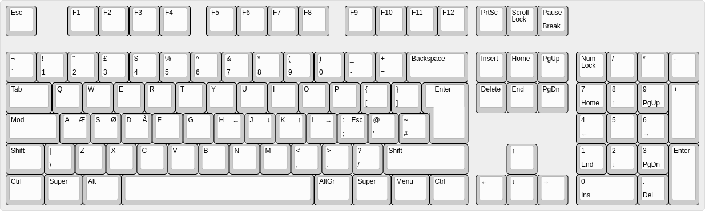

# My custom keyboard layout

My custom keyboard layout, which is the standard American ISO-105 keyboard layout, with the following modifications:

- `CapsLock + h`: Left
- `CapsLock + j`: Down
- `CapsLock + k`: Up
- `CapsLock + l`: Right
- `CapsLock + s`: æ
- `CapsLock + d`: ø
- `CapsLock + f`: å
- `CapsLock + u`: æ
- `CapsLock + i`: ø
- `CapsLock + o`: å
- `CapsLock + S`: Æ
- `CapsLock + D`: Ø
- `CapsLock + F`: Å
- `CapsLock + U`: Æ
- `CapsLock + I`: Ø
- `CapsLock + O`: Å
- `LeftShift + RightShift`: Caps Lock

Compiled using [klfc](https://github.com/39aldo39/klfc)

- Build with nix: `nix build github:rasmus-kirk/keyboard-layout`
- Install my layout with nix (on a non-nixos system): `nix run github:rasmus-kirk/keyboard-layout`
- Install the alternative Cetti layout with nix: `nix run github:rasmus-kirk/keyboard-layout#zi`
